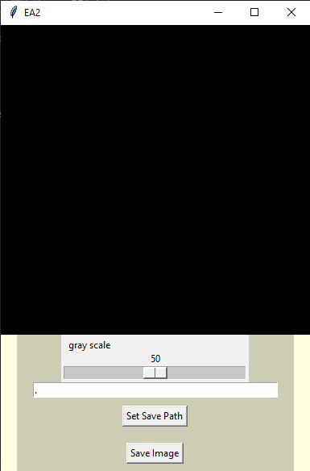
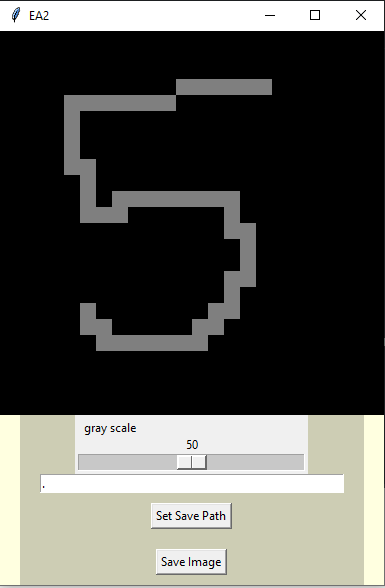
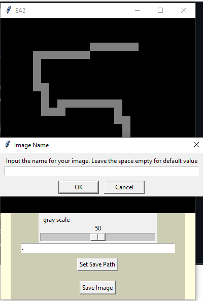

# ExplorationActivity2
This exploration activity is a way for someone to draw their own images for 
my first exploration activity, and use them. 
To run the program:
* Make sure you have all necessary Python libraries installed.
    * Tkinter. It should be installed by default. However `pip install tk`
    * PIL. `pip install pillow`
    * Numpy. `pip install numpy`
* Run the program by typing in the console `python main.py`

The program is a simple GUI that allows you to draw gray 24 x 24 images 
using a magnified canvas. Finally, it allows you to save each image at the desired location.

Example of using the program: 
* Initial window with default saving path: 

* An example of using canvas: 

* Saving the file dialogue window to the default location: 

**The image will be scalled down to 24 x 24, so it can be used in the EA1.** 
***Additionally, you can set the saving path to be the input folder from my EA1.***
---
